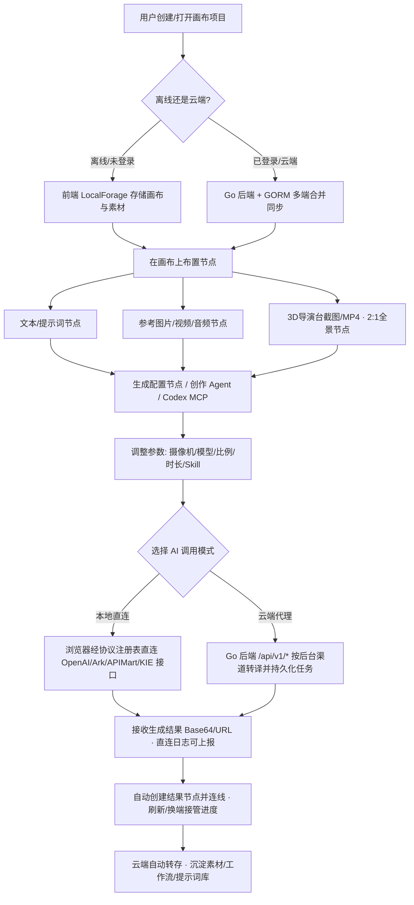

<h1 align="center">无限画布 (infinite-canvas) - 综合技术文档与评估报告</h1>

<p align="center">
  
  
  
  
  
  
  
  
  
  
  
  
  
  
  
  
  
</p>

---

## 📋 项目简介

**无限画布 (infinite-canvas)** 是一款面向 AIGC（图片、视频、音频、文本）全能创作的开源可视化工作台。项目打破传统的线性对话与单排生图模式，将无限自由度的 2D 画布编排、3D 导演台时间轴动画、AI 多模态生成（文生图/图生图/视频/音频/TTS）、2:1 全景环境生成、创作 Agent 与 Codex MCP 接入、Prompt 提示词灵感库与工作流引擎有机融为一体。

无论是探索视觉艺术方案、构建连续镜头的动画分镜，还是沉淀团队图片/视频素材库，均可在同一个高灵活性、高交互性的跨平台工作台中完成。项目提供 Go 轻量后端承担渠道转译、任务持久化与云端同步，同时支持"浏览器离线直连"与"服务端云端代理"双重运行模式。

> [!NOTE]
> 项目全面支持 OpenAI 兼容 API、火山方舟 Ark Seedance（含 Agent Plan）、APIMart、KIE（Kling 等）、MiniMax、Gemini、AutoDL、New API 等多模态渠道；协议层按 OpenAI / 火山方舟明确区分，不再根据模型名猜测渠道。

---

## 🛠️ 技术栈

项目采用**前后端分离架构**：前端基于 Next.js App Router 承载 2D/3D 画布交互，后端 Go 提供 API 代理、任务调度与云同步服务，另附独立的 Node 本地服务包 `canvas-agent` 打通 Codex MCP。

### 1. 前端技术栈 (Frontend Stack)

| 组件/库 | 版本 | 核心用途与选型说明 |
| :--- | :--- | :--- |
| **Core Framework** | Next.js 16.2.9 / React 19.2.5 | App Router 架构，页面入口与 `/api/*` 反向代理承载 |
| **Language** | TypeScript 5.x | 全链路强类型约束，保障画布节点树与 3D 数据安全 |
| **UI Framework** | Ant Design 6.4 + Pro-Components | 设置弹窗、管理后台表格与全局交互组件 |
| **Styling & Motion** | Tailwind CSS v4 + Motion 12.x | 响应式原子样式与组件微交互动画 |
| **State Management** | Zustand 5.0 | 全局状态与画布节点、连线、视口管理 |
| **Data Fetching** | TanStack Query v5 | 异步请求缓存、生成任务状态轮询与去重 |
| **3D & Canvas** | Photo Sphere Viewer 5.14 | 导演台 2:1 全景球形视图渲染与视角捕捉 |
| **Media Processing** | mediabunny 1.55 | 纯前端视频进度条、抽帧、音频提取与剪辑 |
| **Editor** | CodeMirror 6 (@uiw/react-codemirror) | 工作流 JSON、Skill Markdown 编辑 |
| **Protocol Layer** | services/api/protocols | OpenAI / Ark / APIMart / KIE / AutoDL 直连协议转译注册表 |
| **Storage & Utils** | LocalForage / Axios / Dayjs / fflate / jsonrepair | IndexedDB 离线缓存、ZIP、JSON 容错修复等 |

### 2. 后端技术栈 (Backend Stack)

| 组件/库 | 版本 | 核心用途与选型说明 |
| :--- | :--- | :--- |
| **Core Language** | Go 1.25.0 | 高并发、低内存开销，极速代理转译响应 |
| **Web Framework** | Gin 1.11.0 | RESTful 路由划分与中间件鉴权 |
| **ORM Framework** | GORM 1.31.1 | 声明式建模与自动迁移，支持 SQLite / MySQL / PostgreSQL 无缝切换 |
| **SQLite Driver** | glebarez/sqlite (纯 Go) | 免 CGO，交叉编译与容器构建友好 |
| **Security & Auth** | golang-jwt v5.3 + Linux DO OAuth | JWT 会话、可选鉴权访客模式与社区单点登录 |
| **Config** | caarlos0/env v11 + godotenv | 环境变量集中解析与默认值 |
| **Storage Adapter** | S3 / Cloudflare R2 / WebDAV (gowebdav) / Local FS | 统一对象存储抽象，支持云端转存与无引用对象清理 |
| **Task & Schedule** | robfig/cron v3 | 后台定时任务：视频任务全局轮询、日志清理、画布删除调度、提示词同步 |
| **Agent Bridge** | @tigerowo/canvas-agent (Node ≥22) | Express + MCP SDK + Codex CLI 的本地服务，打通外部 Codex 操作画布 |

### 3. AI 服务与集成 (AI Services & Multi-Modal Integrations)

| 模块/服务类型 | 协议/对接渠道 | 详细功能与模型接入说明 |
| :--- | :--- | :--- |
| **图像生成** | OpenAI Compatible `/v1/images/generations` & `/edits` | 文生图、图生图、参考图融合编辑、蒙版编辑、Base64/URL 返回 |
| **视频生成** | OpenAI Videos / 火山方舟 Ark Seedance / KIE (Kling) / MiniMax / AutoDL / APIMart | 标准与 Agent Plan 双端点；Seedance 2.0 最高 15s、2.5 最高 30s，最多 30 参考图 + 10 参考视频 + 10 参考音频；`1080p`/`4k` 直填分辨率 |
| **音频合成 (TTS)** | OpenAI `/v1/audio/speech` / Mimo TTS / Grok TTS / Gemini TTS / MiniMax | 多音色、语速、格式与指令控制，音色列表接口 `/v1/tts/voices` |
| **智能对话与助手** | OpenAI `/v1/chat/completions` & `/v1/responses` | 画布节点上下文问答、生图/生视频工具调用、工作流脚本生成、长历史压缩为长期检查点 |
| **Codex 本地代理** | `npx @tigerowo/canvas-agent` + MCP | 画布内切换 Codex 模式，支持模型/推理强度选择、流式回复、授权确认与外部 Codex 插件接入 |
| **通用渠道转译** | APIMart / New API / 自建反代 | 后台渠道按模型路由，管理后台支持渠道模型拉取与连通性测试 |

---

## 📁 目录结构

```text
infinite-canvas/
├── .github/workflows/    # GitHub Actions CI 与 Docker 镜像构建
├── .agents/              # Agent 交互规范与技能 (Skills) 拓展库
├── assets/               # README 赞助与联系方式图片资源
├── canvas-agent/         # Codex MCP 本地服务 npm 包 (@tigerowo/canvas-agent)
├── config/               # 后端配置解析与环境变量管理
├── docs/                 # 项目全套架构、API 与用户操作文档
│   ├── backend/          # 后端数据库结构、API 协议与系统配置规范
│   ├── business/         # 业务说明与授权 (License) 文档
│   ├── canvas/           # 画布节点操作手册与快捷键指南
│   ├── overview/         # 功能总览、部署说明与第三方 Prompt 库
│   └── progress/         # 任务 TODO 与版本待测试事项
├── handler/              # HTTP 接口层 (入参校验、service 调用、统一 OK/Fail 响应)
├── middleware/           # Gin 中间件 (JWT 鉴权、可选鉴权、管理员、匿名存储、404)
├── model/                # GORM 实体模型 (User, Prompt, Asset, AgentSkill, Task, ...)
├── repository/           # 数据库持久化层 (GORM CRUD 与查询)
├── router/               # Gin 路由集中注册 (公共 /api、用户 /api/v1、管理 /api/admin)
├── service/              # 核心业务层 (协议转译、媒体存储、异步任务、Skill 初始化)
│   └── skills/           # 内置系统 Agent Skill (H3 视频生成系列模板)
├── web/                  # Next.js 前端应用源码
│   ├── public/director/  # 导演台 3D 编辑器独立构建产物
│   └── src/
│       ├── app/(user)/   # 画布主页 (canvas/[id])、生图、视频、工作流、素材、提示词
│       │   └── canvas/   # 画布核心：agent/ (Agent 运行时与 Skill)、components/、stores/、utils/
│       ├── app/(admin)/  # 管理后台：用户/积分/AI日志/设置/提示词/素材/系统 Skill
│       ├── components/   # 跨页面通用组件与设置面板
│       ├── hooks/        # 全局与页面私有 React Hooks
│       ├── lib/          # 各渠道协议工具 (ark/kie/minimax/gemini/autodl/...) 与主题
│       ├── services/     # Axios API 客户端、协议注册表与本地/云存储迁移服务
│       └── stores/       # Zustand 状态库 (画布、配置、素材、Agent Skill)
├── .env.example          # 环境变量模板
├── Dockerfile            # 生产镜像多阶段构建 (Bun 构建前端 → Go 构建后端)
├── docker-compose.yml    # 标准容器化部署编排 (GHCR 镜像)
├── docker-compose.local.yml # 本地源码构建编排
├── go.mod / go.sum       # Go 依赖声明与锁定
├── main.go               # 后端服务主入口
└── VERSION               # 当前版本号 (v0.7.1)
```

---

## ⚡ 核心功能模块和工作流程

### 1. 核心功能模块

1. 🎨 **无限 2D 交互画布 (Infinite 2D Canvas)**
   - **多节点编排**：图片、文本、生成配置、全景图、导演台五类节点，支持双击创建菜单、框选多选与节点分组。
   - **自由度交互**：平移缩放、小地图、三种背景、浅/深主题、复制粘贴、撤销重做 (Undo/Redo)、JSON 导入导出。
   - **数据推导**：左右连接点建立上下游依赖，高亮关联链路，流式传递提示词与媒体输入。
   - **媒体清理**：撤销历史保留期内媒体不删除，历史淘汰后自动清理无引用云文件，保留跨画布共享引用。

2. 🎬 **3D 导演台与时间轴动画 (Director Desk & Timeline)**
   - **场景搭建**：内置 8 种角色 × 20 种姿势、群演阵列、几何体与本地模型导入，2:1 全景图作为天空环境。
   - **机位镜头**：导演/机位双视角、视口比例框与九宫格、四/十二方位截图，机位画面自动发送为连线图片节点。
   - **时间轴动画**：位置/旋转/缩放/姿势关键帧轨道、速度曲线调节、30 FPS 吸附、60 FPS 预览播放。
   - **视频导出**：活动机位一键导出 1280×720 @ 30FPS H.264 MP4，结果自动进入画布视频节点。

3. 🎥 **专业摄像机参数系统 (Camera Control)**
   - 图片、视频与生成配置节点独立设置相机、镜头、焦距与光圈，光学参数自动编译写入生成 Prompt，随节点保存、复制与继承。

4. 🤖 **多模态 AIGC 引擎 (Multimodal AI Engine)**
   - **图像**：文生图、图生图、参考图蒙版编辑、多角度变换、裁剪重生成、批量图片组与主图切换。
   - **视频**：OpenAI 风格与火山方舟 Ark Seedance 双协议；多参考图/视频/音频联合引导，480p~4K 多档位；任务后端持久化，跨设备刷新接管进度。
   - **音频**：多引擎 TTS (OpenAI / Mimo / Grok / Gemini / MiniMax)，画布音频节点一键朗读。
   - **直连模式**：未登录浏览器直连 OpenAI 兼容接口；登录后渠道配置随账号同步并复用后端转译链路。

5. 🧠 **创作 Agent 与 Codex MCP (Canvas Assistant & Agent)**
   - **创作 Agent**：围绕选中节点及上游引用分析、规划并生成图片/视频/文本，结果自动插回画布；Chat / Responses 双协议；长历史自动压缩为长期检查点；工具调用批量校验与 JSON 自动修复。
   - **Codex 模式**：通过 `canvas-agent` 本地服务将画布暴露为 MCP 工具，支持本机 Codex 或外部 Codex CLI 插件直接操作画布，含授权确认卡片、会话绑定与断线恢复。
   - **Agent Skill**：输入框最多激活 5 个 Skill（系统/账号/本地三级），支持目录与附属 Markdown 文件、管理后台可视化编辑排序，新项目首次创建自动导入内置 Skill 库。

6. 📚 **提示词库与素材沉淀 (Prompt Hub & Asset Manager)**
   - 自动抓取整合多个 GitHub 开源提示词仓库，按分类标签整理；"我的素材"(本地 IndexedDB) 与"素材库"(云端) 双轨管理，可回填画布与工作流。
   - **创作工作流**：公开/个人模板、变量表单、AI 一键生成工作流草稿、系列图工作流与结果自动入库。

7. ☁️ **云端同步与存储矩阵 (Cloud Sync & Storage)**
   - S3/R2/WebDAV/本地多后端，开启"全部素材云端同步"后生成结果自动转存；用户个人存储优先；未登录也可按授权使用已配置的个人存储。
   - 登录后画布项目、素材、生成记录、模型渠道与存储配置按时间戳多端合并同步。

---

### 2. AIGC 画布创作工作流程



---

## ⚙️ 部署指南

### 1. Windows 桌面版（零构建）

官方 Releases 提供本地安装包，下载解压即可运行，无需安装任何开发环境：

> https://github.com/tigerowo/infinite-canvas/releases/latest

### 2. Docker Compose 快速部署（推荐生产环境）

```bash
git clone https://github.com/tigerowo/infinite-canvas.git
cd infinite-canvas

cp .env.example .env    # 修改 JWT_SECRET、管理员账号密码
docker compose up -d    # 默认拉取 GHCR 预构建镜像 ghcr.io/tigerowo/infinite-canvas:latest
```

本地源码构建镜像：

```bash
cp .env.example .env
docker compose -f docker-compose.local.yml up -d --build
```

服务默认映射主机 `3000` 端口，访问 `http://localhost:3000`；Docker 镜像内 Next.js 提供页面入口并将 `/api/*` 代理到内部 Go 服务 (8080)，数据卷挂载 `./data:/app/data`。

### 3. 本地开发环境部署 (Local Development)

**前置要求**：Go `1.25+`、Node.js `20+` 或 Bun、（可选）Node `22+` 用于 Codex MCP 本地服务

```bash
# 终端 1：后端 (默认监听 8080)
cp .env.example .env
go run .

# 终端 2：前端 (监听 3000，/api 代理到 8080)
cd web
bun install
bun run dev
```

### 4. 环境变量配置说明 (`.env`)

| 变量名 | 默认值 | 含义与配置说明 |
| :--- | :--- | :--- |
| `PORT` | `8080` | Go 后端服务监听端口（Docker 内勿覆盖，前端固定 3000） |
| `ADMIN_USERNAME` | `admin` | 首次启动自动创建的初始管理员账号 |
| `ADMIN_PASSWORD` | `infinite-canvas` | 初始管理员密码 |
| `JWT_SECRET` | `infinite-canvas` | JWT Token 签名密钥（生产环境务必更改） |
| `JWT_EXPIRE_HOURS` | `168` | 登录会话有效期（小时） |
| `STORAGE_DRIVER` | `sqlite` | 数据库类型，可选 `sqlite` / `mysql` / `postgres` |
| `DATABASE_DSN` | `data/infinite-canvas.db` | 数据库连接串；MySQL/PG 目标库不存在时自动创建；Docker 建议绝对路径 |
| `LINUX_DO_AUTHORIZE_URL` 等 | 官方地址 | Linux DO OAuth 授权/令牌/用户信息三个端点，可按需替换 |
| `AI_LOG_DIR` | `data/logs/ai-calls` | AI 调用日志落盘目录 |
| `API_BASE_URL` | `http://127.0.0.1:8080` | 仅前端开发代理使用，后端端口不同才需设置 |

### 5. Codex MCP 本地服务（可选）

```bash
npx -y @tigerowo/canvas-agent@latest          # 启动本地桥接服务（首次自动生成 Token）
npx -y @tigerowo/canvas-agent@latest mcp      # 作为外部 Codex 的 MCP 入口
```

外部 Codex 亦可通过 GitHub 插件市场安装 `canvas-agent@infinite-canvas` 插件直接操作画布。

---

## 📦 API 接口概览

后端统一提供 RESTful API，业务接口遵循 `{ "code": 0, "data": ..., "msg": "ok" }` 响应约定。

### 1. 公共与认证 API (`/api/*`)

| HTTP Method | API Endpoint | 鉴权要求 | 接口说明 |
| :--- | :--- | :--- | :--- |
| `GET` | `/api/health` | 公开 | 健康检查 |
| `POST` | `/api/auth/register` | 公开 | 用户注册（后台可关闭） |
| `POST` | `/api/auth/login` | 公开 | 用户登录，返回 JWT Token |
| `GET` | `/api/auth/linux-do/authorize` `/callback` | 公开 | Linux DO OAuth 单点登录 |
| `GET` | `/api/auth/me` | 可选 | 当前用户信息，未登录返回访客 |
| `GET` | `/api/settings` | 公开 | 系统公开配置（可用模型/渠道限制） |
| `GET` | `/api/storage/config` | 公开 | 前台存储能力配置 |
| `GET` | `/api/files/:id` `/content` · `/api/proxy-image` | 公开 | 文件元信息、内容与图片代理 |
| `POST` | `/api/anonymous/files` | 匿名存储 | 未登录用户的匿名上传/删除 |
| `GET` | `/api/prompts` `/api/assets` | 可选 | 公共提示词库与服务器素材列表 |
| `GET` | `/api/agent-skills` `/:id/file` | 公开 | 系统 Skill 列表与附属文件读取 |
| `POST` | `/api/admin/login` | 公开 | 管理员登录 |

### 2. AIGC 代理与任务 API (`/api/v1/*`，用户 Token)

| HTTP Method | API Endpoint | 接口说明 |
| :--- | :--- | :--- |
| `POST` | `/v1/images/generations` `/v1/images/edits` | 统一文生图与图生图/参考图编辑 |
| `POST` | `/v1/chat/completions` `/v1/responses` | LLM 文本/多模态对话与 Responses 协议 |
| `POST` | `/v1/audio/speech` · `GET /v1/tts/voices` | TTS 语音合成与音色列表 |
| `POST` | `/v1/videos` · `GET /v1/videos/:id` `/content` | 提交视频生成任务（含 Ark Seedance）与结果拉取 |
| `GET/DELETE` | `/v1/video-tasks` `/:id` | 视频任务列表查询与删除 |
| `POST/GET` | `/v1/canvas/image-tasks` `/status` `/:id` | 画布并发图片任务创建、批量状态轮询、详情与删除 |
| `POST/GET` | `/v1/canvas/audio-tasks` `/:id` | 画布音频生成任务 |
| `POST` | `/v1/ai-logs` | 本地直连模式的调用日志上报 |

### 3. 数据同步与个人配置 API (`/api/v1/*`，用户 Token)

| HTTP Method | API Endpoint | 接口说明 |
| :--- | :--- | :--- |
| `GET/POST` | `/v1/canvas/projects` · `/sync` · `/delete` | 画布项目读取、保存、多端时间戳合并同步与批量删除 |
| `GET/POST` | `/v1/user-data/assets` `/image-history` | 个人素材与生图历史云同步 |
| `GET/POST/DELETE` | `/v1/generation-logs/images` `/videos` | 图片/视频生成记录同步、批量软删除与清理 |
| `GET/POST/DELETE` | `/v1/workflows` · `/agent-draft` | 创作工作流管理与 AI 生成工作流草稿 |
| `GET/POST/DELETE` | `/v1/agent-skills` `/:id` | 用户个人 Agent Skill 管理 |
| `GET/POST` | `/v1/user-config` `/model` `/storage` | 用户模型渠道与个人 S3/R2 存储配置同步 |
| `POST/DELETE` | `/v1/files` `/direct` `/:id/record` · `/storage/measure` | 文件上传、直传登记、删除与存储连通性测量 |

### 4. 管理后台 API (`/api/admin/*`，管理员 Token)

| HTTP Method | API Endpoint | 接口说明 |
| :--- | :--- | :--- |
| `GET/POST/DELETE` | `/users` · `/users/:id/credits` | 用户管理、积分配额调整与删除 |
| `GET/POST/DELETE` | `/credit-logs` | 积分流水管理 |
| `GET/DELETE` | `/ai-logs` | 全局 AI 调用日志查询与清理 |
| `GET/POST` | `/settings` · `/channel-models` · `/channel-test` | 系统设置、渠道模型拉取与连通性测试 |
| `POST` | `/storage/measure` | 服务器对象存储测量 |
| `GET/POST` | `/prompt-categories/sync` `/sync-all` · `/prompts` `/batch-delete` | 远程提示词源同步与提示词增删改查 |
| `GET/POST/DELETE` | `/agent-skills` `/:id/files` | 系统 Skill 及附属文件目录管理 |
| `GET/POST/DELETE` | `/assets` `/:id` | 服务器素材库管理 |

---

## 💡 总结与展望

### 1. 项目优势评估 (Project Strengths)

- 🌟 **跨维度创客体验**：2D 无限节点画布与 3D 导演台时间轴动画深度打通，从机位摆拍、关键帧动画、全景生成到 MP4/图像成片形成完整闭环。
- 🤝 **Agent 生态双轨制**：内置创作 Agent 与外部 Codex MCP 共享同一套画布工具与生成链路，Skill 三级体系（系统/账号/本地）让创作方法论可沉淀、可分发。
- ⚡ **极致架构性能**：Go 极简后端 + Next.js 16 现代前端，纯 Go SQLite 驱动免 CGO，内存占用低、构建链路简单，非常适合私有化部署。
- 🔌 **协议级渠道抽象**：OpenAI / 火山方舟双协议显式区分，前端协议注册表与后端渠道转译对称，新渠道以独立 handler/service 模块化接入。
- 🛡️ **云端离线双向保障**：未登录本地可用、登录后多端时间戳合并同步，云文件引用计数清理避免孤儿对象，兼顾数据隐私与跨设备协同。

### 2. Future Roadmap

- 📱 **移动端与 Touch 触控优化**：系统性完善 iPad / 平板设备上的画布手势缩放与拖拽体验（当前明确标注桌面优先）。
- 🎭 **3D 资产库拓展**：丰富导演台角色模型、骨骼动画与物理光影设置，并支持跨账号分享。
- 🔄 **节点级 Workflow 自动化引擎**：引入类似 ComfyUI 的条件分支与循环管道节点，强化批量 AIGC 流水线能力。
- 🗄️ **数据与权限演进**：用户管理前端页面补齐、服务器素材文件上传接口与更细粒度的渠道配额控制。

---
<p align="center">Made with ❤️ for AI Creators & Artists.</p>
